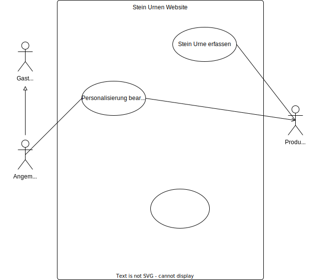

# Einleitung
 In der Einleitung sind Explore-,Create-, Evaluate-Board und die Erkenntnisse aus dem Pitch Zusammengefasst.

#  EXPLORE BOARD: SteinUrnen

## TRENDS & TECHNOLOGIE
> Der zunehmende Online-Handel machen eine benutzerfreundliche Website unverzichtbar für den Verkauf nachhaltiger Steinurnen aus Flusssteinen. 
> Die höhere Nachfrage nach Individualisierung fordert deutlich mehr Beratungszeit der Kunden. 
> Mit einem Fokus auf umweltfreundlichen Materialien und nachhaltiger Produktion können Kundenbedürfnisse nach ethischen und ökologisch verträglichen Produkten erfüllt werden.
> Die potenzielle Integration von Virtual Reality-Technologie kann Kunden helfen, die Steinurnen aus Flusssteinen virtuell anzusehen und sich ein genaues Bild von ihrem Aussehen zu machen, bevor sie eine Kaufentscheidung treffen.

## POTENTIELLE PARTNER & WETTBEWERB
> Zuverlässige Hosting-Anbieter können eine wichtige Rolle bei der Bereitstellung einer stabilen und sicheren Online-Präsenz spielen.
> Logistikpartner, wie die beispielsweise die Post, die sich auf die Lieferung und den Versand spezialisieren, können eine reibungslose Lieferkette sicherstellen und eine schnelle und zuverlässige Auslieferung der Steinurnen an die Kunden gewährleisten.

## FAKTEN
> Das Feld Fakten ist gewissermassen unser Joker. Hier steht alles, was sich in den anderen Feldern nicht einordnen lässt, aber irgendwie mit unserem Recherchethema zu tun hat.

## POTENZIALFELDER
> Die Integratin einer klar separierten Sparte von Steinurnen für Tiere die, die Kunden in ihrem leben begleitet haben.

## USER
> Menschen mit kürzlich verstorbenen Angehörigen.
> Menschen mit kürzlich verstorbenen Haustieren.
> Händler und Händlerinnen, die Urnen vertreiben.

## BEDÜRFNISSE
> Eine Informationsqelle die über Stein Urnen aus Flusssteinen aufklären.
> Einfache Personalsisierung der Stein Urne.
> Einfacher einkauf von Stein Urnen.

## ERKENNTNISSE
> Im Kontext der Website von Stein Urnen sammeln wir Erkenntnisse über die Bedürfnisse und Emotionen der Benutzer, die sich mit dem sensiblen Thema der Trauer und des Gedenkens befassen. Diese Erkenntnisse ermöglichen es uns, nicht nur die physischen Anforderungen der Benutzer zu verstehen, sondern auch ihre emotionalen Bedürfnisse besser zu erfassen. Darüber hinaus suchen wir nach Analogien, die uns helfen, die Erfahrung des Trauerprozesses und des Gedenkens aus verschiedenen Blickwinkeln zu betrachten, um unsere Website entsprechend einfühlsam und unterstützend zu gestalten.

## TOUCHPOINTS
> Das Feld Touchpoints listet die Berührungspunkte auf, die User mit einem Service oder Produkt haben.
- Stein Urne
- Lieferant
- Anwendung
- Personalisierung

## WIE KÖNNEN WIR?
>Wie können wir sicherstellen, dass die Website von Stein Urnen nicht nur informative und funktionale Inhalte bietet, sondern auch einfühlsame und unterstützende Ressourcen bereitstellt, die den Nutzern dabei helfen, mit ihren Trauer- und Gedenkprozessen umzugehen?

#  CREATE BOARD: SteinUrnen

## IDEEN-BESCHREIBUNG
> eine Web Anwendung die Informationen, einen Shop sowie die Personalisierung für Stein Urnen bietet. Unsere handgefertigten Stein Urnen aus natürlichen Flusssteinen sind nicht nur ästhetisch ansprechend, sondern auch nachhaltig. Jede Urne ist ein Unikat, das die Persönlichkeit des Verstorbenen würdigt und den Familien Trost in schweren Zeiten bietet.

## ADRESSIERTE NUTZER
>Menschen mit kürzlich verstorbenen Angehörigen.
> Menschen mit kürzlich verstorbenen Haustieren.
> Händler und Händlerinnen, die Urnen vertreiben.

## ADRESSIERTE BEDÜRFNISSE
- Informationen über Steinurnen
- die möglichkeit Stein Urnen online zu Kaufen
- beistand und hilfestellung mit Umgang des Trauerfall
- Einfache handhabung
- Oekologische Nachhaltigkeit

## PROBLEME 
> Es gibt keinen Web Shop für Stein Urnen aus natürlichen Flusssteinen. 
> Es sind nur wenige informationen von Stein Urnen aus natürlichen Flusssteinen verfügbar. 

## IDEENPOTENZIAL
Mehrwert: Mückenstich vs. Hai-Attacke

🔵🔵🔵🔵🔵🔵🔵🔵⚪️⚪️

Übertragbarkeit: Robinson Crusoe vs. die Welt

🔵⚪️⚪️⚪️⚪️⚪️⚪️⚪️⚪️⚪️

Machbarkeit: Hammer vs. Raumschiff

🔵🔵🔵🔵🔵⚪️⚪️⚪️⚪️⚪️

## DAS WOW
> Stein Urnen aus natürlichen Flusssteinen.

## HIGH-LEVEL-KONZEPT
> die einfach nutzbare und im Trauerprozess unterstützende Web Anwendung die Informationen, den Verkauf und Personalisierung von Stein Urnen aus natürlichen Flusssteinen handhabt.

## WERTVERSPRECHEN
Unsere Webanwendung bietet eine benutzerfreundliche Plattform, die den gesamten Prozess von Informationen, Verkauf und Personalisierung von Steinurnen aus natürlichen Flusssteinen nahtlos unterstützt. In Zeiten der Trauer steht unsere Anwendung den Nutzern einfühlsam und unterstützend zur Seite, indem sie ihnen eine einfache und zugängliche Lösung bietet, um würdevolle Erinnerungsstücke für ihre Liebsten zu gestalten.

#  EVALUATE BOARD: SteinUrnen

## KANÄLE
- Soziale Medien
- Partnerschaften und Kooperationen
- Örtliche Präsenz 

## UNFAIRER VORTEIL
> Einzigartige Designs und hochwertige Handwerkskunst tragen dazu bei, dass die Stein Urnen aus der Masse herausragen und schwer zu imitieren sind.
> Die Erfahrung des Trauerprozesses und des Gedenkens aus verschiedenen Blickwinkeln zu betrachten, um unsere Website entsprechend einfühlsam und unterstützend zu gestalten sorgt für Einzigartigkeit.

## KPI
- Anzahl Verkäufe 
- Anzahl Kunden

## EINNAHMEQUELLEN
> Unsere Einnahmequelle liegt darin, dass wir Stein Urnen verkaufen die teilweise auch personalsisiert sind. 

# Erkenntnisse aus dem Pitch

Grundsätzlich wurde das Thema und der Zweck des Projekts als gut gewählt und klar definiert empfunden.
Aus dem Feedback geht hervor das es wichtig ist zwischen einer Vermittlungsplattform und einem Online Shop zu unterscheiden.
Der Bauersteine Urnenhandel ist eigentlich eine Vermittlungsplattform zwischen Produzenten und den Kunden. 
E-mail implementierung wurde vorgeschlagen was sicher eine sinnvolle anwendung findet.
DIe Visuelle darstellung von Personalisierung wurde auch vorgeschlagen.Das ist jedoch eher ein Bonusangelegenheit wenn noch genügend zeit vorhanden ist. 